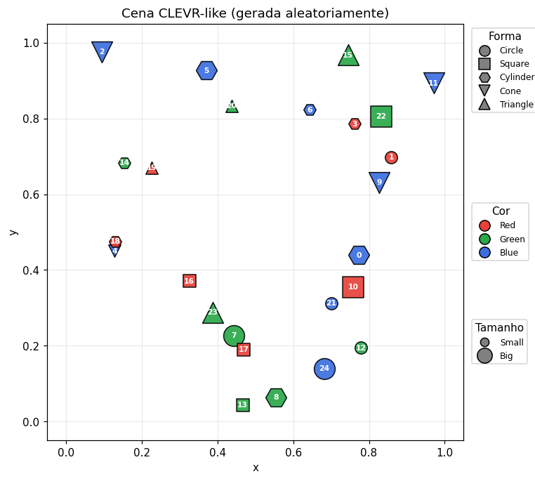

# Logic Tensor Networks para Raciocínio Espacial em Cenas CLEVR-like

> Trabalho final — **Inteligência Artificial (IEC034 / ICC265 — 2026/1)** · Prof. Edjard Mota · UFAM
> Autor: _[seu nome — matrícula]_

Agente **neuro-simbólico (NeSy)** que aprende a raciocinar sobre relações espaciais em um
ambiente **CLEVR simplificado** usando **Logic Tensor Networks** (LTNtorch). Em vez de
processar imagens, cada objeto é um **vetor de características** de 11 dimensões; os
predicados são redes neurais e o conhecimento de domínio é codificado como **axiomas de
lógica de primeira ordem diferenciável**, treinados maximizando a satisfatibilidade da base
de conhecimento.

Tudo está em **`clevr_ltn_spatial.ipynb`** (notebook autocontido, já executado com as saídas
embutidas). Este README cobre os quatro itens de texto exigidos na entrega: (1) NeSy e LTN,
(2) o dataset CLEVR e a descrição simplificada, (3) o satAgg das fórmulas e (4) o experimento
de 5 execuções com acurácia, precisão, recall e F1.

---

## 1. NeSy e Logic Tensor Networks

A **IA Neuro-simbólica** combina o aprendizado sub-simbólico das redes neurais com o rigor e a
interpretabilidade da lógica. **Logic Tensor Networks (LTN)** realiza essa ponte por meio de um
mapeamento contínuo chamado **grounding** `G`, que envia símbolos da Lógica de Primeira Ordem
para tensores e operações diferenciáveis:

| Símbolo lógico | LTNtorch | Grounding `G` |
|---|---|---|
| Constante `c` | `ltn.Constant` | tensor real (ex.: vetor do objeto) |
| Variável `x` | `ltn.Variable` | sequência de indivíduos |
| Predicado `P` | `ltn.Predicate` | rede `R^n → [0,1]` (verdade fuzzy) |
| Função `f` | `ltn.Function` | camada `R^n → R^m` |

**Lógica fuzzy diferenciável** (assinatura idêntica à do notebook de referência `XAI_In_LTN.ipynb`):

| Conectivo | Operador | Grounding |
|---|---|---|
| `¬` | `NotStandard` | `1 − p` |
| `∧` | `AndProd` (T-norma do produto) | `p · q` |
| `∨` | `OrProbSum` | `p + q − p·q` |
| `→` | `ImpliesReichenbach` | `1 − p + p·q` |
| `∀` | `AggregPMeanError(p=2)` | média-`p` do erro (pune desvios da verdade) |
| `∃` | `AggregPMean(p=2)` | média-`p` |

O treino **maximiza** a satisfatibilidade global (`SatAgg`): `loss = 1 − SatAgg(K)`.

### Por que axiomas estruturais não bastam — a solução degenerada

No exemplo mínimo de referência, treinando **somente** o axioma de assimetria
`∀x,y (LeftOf(x,y) → ¬LeftOf(y,x))`, a rede converge para `LeftOf ≡ 0` em todos os pares.
Isso satisfaz a assimetria **trivialmente** (`0 → ¬0 = 0 → 1 = verdadeiro`), mas é
geometricamente **errado** — a rede não aprendeu nada sobre "esquerda".

Por isso, a nossa base de conhecimento combina **fatos de grounding** (supervisão a partir das
coordenadas e atributos) **com os axiomas estruturais**: os fatos ancoram a semântica real
enquanto os axiomas atuam como regularizadores lógicos. É a sinergia *top-down* (axiomas guiam
os pesos) descrita nos slides da disciplina.

### Horizonte teórico — fibring

O artigo *From Neural Networks to Logical Theories* (El Harzli, d'Avila Garcez et al., ICLR 2026)
formaliza a correspondência exata entre **fibring de redes neurais** e **fibring de lógicas
modais**, oferecendo a contrapartida *bottom-up*: extrair as teorias lógicas que arquiteturas
profundas (GNNs, GATs, Transformers) aprendem nativamente.

---

## 2. O dataset CLEVR e a versão simplificada

O **CLEVR** (Johnson et al., 2017) é um benchmark de *Visual Question Answering* com cenas
sintéticas 3D de objetos (formas, cores, materiais, tamanhos) e perguntas composicionais que
exigem contagem, comparação e raciocínio espacial multi-passo. O tutorial de referência
(`edjard/Clevr_LTNtorch`) usa a versão por **imagens** com CNNs.

Aqui usamos a **versão simplificada por vetores de características** pedida no enunciado, evitando
o processamento pesado de imagens. Cada objeto é um vetor de **11 dimensões**:

| índice | conteúdo |
|---|---|
| `[0,1]` | posição `x, y` normalizada em `[0,1]` |
| `[2,3,4]` | cor *one-hot* (Red, Green, Blue) |
| `[5,6,7,8,9]` | forma *one-hot* (Circle, Square, Cylinder, Cone, Triangle) |
| `[10]` | tamanho (`0.0` = small, `1.0` = big) |

Cada cena tem 25 objetos aleatórios, plotados no estilo CLEVR-like:



### Predicados

- **Atributo (neurais):** `isCircle`, `isSquare`, `isCylinder`, `isCone`, `isTriangle`,
  `isRed`, `isGreen`, `isBlue`, `isSmall`, `isBig`. Cada grupo (forma/cor/tamanho) **compartilha
  uma rede** com múltiplas saídas, para que os axiomas de unicidade e cobertura realmente acoplem
  os predicados.
- **Relações espaciais (neurais):** `leftOf`, `rightOf`, `below`, `above` — redes binárias sobre
  **dois objetos concatenados** (22-dim), como o `LeftOfModel` da referência.
- **Analíticos (sem parâmetros):** `closeTo` (núcleo gaussiano `e^(−γ·‖xpos−ypos‖²)`),
  `sameSize`, `horizClose` (alinhamento horizontal para `canStack`) e `diff` (distingue o próprio
  objeto, para excluir o caso `y = x` em fórmulas `∀y`).
- **Compostos:** `inBetween(x,y,z)` e `canStack(x,y)`, definidos via conectivos sobre os predicados
  acima.

> **Sobre `γ` em `closeTo`:** o enunciado sugere coeficiente 2, mas em coordenadas normalizadas
> isso torna quase todo par "próximo". Usamos `γ = 10`, de modo que `closeTo > 0.5` corresponda a
> distância `≲ 0.26` — uma noção discriminativa de proximidade no quadrado unitário.

### Base de conhecimento (axiomas)

- **Atributos:** unicidade pareada `∀x ¬(isForma_i(x) ∧ isForma_j(x))` e cobertura
  `∀x ⋁_s isForma_s(x)` (idem para tamanho).
- **Horizontais:** irreflexividade `¬LeftOf(x,x)`; assimetria `LeftOf(x,y) → ¬LeftOf(y,x)`;
  inverso `LeftOf(x,y) ↔ RightOf(y,x)`; transitividade
  `LeftOf(x,y) ∧ LeftOf(y,z) → LeftOf(x,z)`.
- **Verticais:** inverso `Below(x,y) ↔ Above(y,x)` e transitividade de `Below`.

O grounding das relações usa **`ltn.diag`** (pares casados índice-a-índice, positivos e negativos
separados) e a função `clamp` protege o `SatAgg` contra NaN/Inf.

---

## 3. As consultas da Tarefa 4 e a taxonomia de raciocínio

As consultas compostas instanciam diretamente a taxonomia de raciocínio NeSy compartilhada pelo
professor:

| Consulta | Fórmula | Nível |
|---|---|---|
| **q1** | `∃x (Small(x) ∧ ∃y(Cyl(y) ∧ Below(x,y)) ∧ ∃z(Sq(z) ∧ LeftOf(x,z)))` | Nível 2 — Filtragem Relacional Composta |
| **q2** | `∃x,y,z (Cone(x) ∧ Green(x) ∧ InBetween(x,y,z))` | Nível 2 — Dedução de Posição Absoluta |
| **q3** | `∀x,y ((Tri(x) ∧ Tri(y) ∧ CloseTo(x,y)) → SameSize(x,y))` | Nível 4 — Implicação Material / *vacuous truth* |

### Interpretando consultas existenciais (ponto extra)

O `satAgg` de um `∃` aninhado com `∧` **comprime** o valor agregado mesmo quando uma testemunha
existe (o produto de várias verdades `~0.9` decai, e a média-`p` agrega sobre todos os objetos,
a maioria dos quais não satisfaz). Por isso, além do `satAgg`, reportamos para cada consulta:

- a **resposta do ground-truth** (booleana, computada com os rotuladores geométricos), e
- a **confiança da melhor testemunha** segundo a rede treinada.

Assim a consulta fica interpretável: um `∃` verdadeiro pode ter `satAgg` baixo, mas se a melhor
testemunha tem confiança alta e o ground-truth confirma, a rede de fato **encontrou** o objeto.
O notebook gera ainda uma explicação textual por consulta (seção 6).

---

## 4. Resultados — experimento de 5 execuções

Repetimos a geração de dados **5 vezes** (5 datasets aleatórios distintos, seeds `11/29/47/83/101`),
treinamos a KB em cada um (300 épocas, Adam `lr=0.01`) e avaliamos no próprio dataset gerado.

### Tabela A — Predicados aprendidos (média ± desvio)

| Predicado | Acurácia | Precisão | Recall | F1 |
|---|---|---|---|---|
| isCircle / isSquare / isCylinder / isCone / isTriangle | 1.00 ± 0.00 | 1.00 ± 0.00 | 1.00 ± 0.00 | 1.00 ± 0.00 |
| isRed / isGreen / isBlue | 1.00 ± 0.00 | 1.00 ± 0.00 | 1.00 ± 0.00 | 1.00 ± 0.00 |
| isSmall / isBig | 1.00 ± 0.00 | 1.00 ± 0.00 | 1.00 ± 0.00 | 1.00 ± 0.00 |
| **leftOf** | 1.00 ± 0.00 | 1.00 ± 0.00 | 1.00 ± 0.01 | 1.00 ± 0.00 |
| **rightOf** | 1.00 ± 0.00 | 1.00 ± 0.00 | 0.99 ± 0.01 | 1.00 ± 0.00 |
| **below** | 0.99 ± 0.01 | 1.00 ± 0.00 | 0.99 ± 0.01 | 0.99 ± 0.01 |
| **above** | 1.00 ± 0.01 | 1.00 ± 0.00 | 0.99 ± 0.01 | 1.00 ± 0.01 |

### Tabela B — Fórmulas / axiomas / consultas: satAgg (média ± desvio)

| Fórmula | satAgg |
|---|---|
| irreflex_leftOf | 0.981 ± 0.006 |
| asymmetry_leftOf | 0.991 ± 0.002 |
| inverse_left_right | 0.822 ± 0.003 |
| transitivity_leftOf | 0.997 ± 0.000 |
| inverse_below_above | 0.746 ± 0.001 |
| transitivity_below | 0.945 ± 0.000 |
| exists_left_of_all_squares | 0.762 ± 0.090 |
| square_right_of_circle | 0.854 ± 0.046 |
| lastOnTheLeft | 0.429 ± 0.014 |
| lastOnTheRight | 0.384 ± 0.001 |
| closeTo_avg (proximidade média) | 0.177 ± 0.016 |
| inBetween_exists | 0.404 ± 0.004 |
| canStack_exists | 0.583 ± 0.024 |
| **q1** small_below_cyl_left_sq | 0.044 ± 0.023 |
| **q2** green_cone_between | 0.102 ± 0.053 |
| **q3** triangles_close_samesize | 0.956 ± 0.028 |

### Tabela C — Consultas existenciais: satAgg × testemunha × ground-truth

| Consulta | satAgg | Confiança da testemunha | Resposta GT | Concordância |
|---|---|---|---|---|
| **q1** | 0.044 | 0.79 ± 0.03 | 100% SIM | **100%** |
| **q2** | 0.102 | 0.64 ± 0.32 | 80% SIM | **100%** |

`q3` (universal): satAgg 0.956 ± 0.028, com em média 3.4 pares de triângulos próximos por cena.

### Leitura dos resultados

- Os **predicados de atributo** atingem métricas perfeitas: o grounding permite que as redes
  "leiam" cor/forma/tamanho do vetor sob as restrições lógicas.
- As **relações espaciais** chegam a ~0.99–1.00 de F1 e os **axiomas estruturais** têm satAgg
  alto — a rede aprendeu uma relação espacial **logicamente consistente**, não apenas memorizada.
- As **consultas existenciais** têm satAgg baixo por construção, mas a **confiança da testemunha**
  e a **concordância de 100% com o ground-truth** mostram que são respondidas corretamente —
  ilustrando a diferença entre satisfação *fuzzy* agregada e resposta *crisp*.
- **q3** evidencia *vacuous truth*: sem pares de triângulos próximos, a implicação é trivialmente
  satisfeita; daí o satAgg alto mesmo quando, estritamente, há contraexemplos esparsos.

---

## Como executar

```bash
pip install -r requirements.txt
jupyter notebook clevr_ltn_spatial.ipynb     # "Run All" — leva ~3 min em CPU
```

O notebook gera a cena, treina os predicados, avalia métricas e satAgg, executa as consultas com
explicações de raciocínio e roda o experimento das 5 execuções, salvando `experiment_results.json`.

Ou alternativamente é possivel realizar a execução do jupyer notebook no ambiente do google colab
```bash
https://colab.research.google.com/drive/11cD6DB5BgJK5qiDm3aOze_FJdS-bV63j?usp=sharing
```

## Estrutura

```
clevr_ltn_spatial.ipynb     notebook autocontido (executado, com saídas)
README.md                   este documento
requirements.txt            dependências
scene.png                   exemplo de cena gerada
```

## Referências

- S. Badreddine, A. d'Avila Garcez, L. Serafini, M. Spranger. *Logic Tensor Networks*. Artificial Intelligence, 2022.
- O. El Harzli, B. Cuenca Grau, A. d'Avila Garcez, I. Horrocks, T. R. Besold. *From Neural Networks to Logical Theories*. ICLR 2026.
- J. Johnson et al. *CLEVR: A Diagnostic Dataset for Compositional Language and Elementary Visual Reasoning*. CVPR 2017.
- T. Carraro. **LTNtorch** — `tommasocarraro/LTNtorch`.
- E. Mota. *A Simple XAI in LTN* (slides) e tutorial `edjard/Clevr_LTNtorch`.
